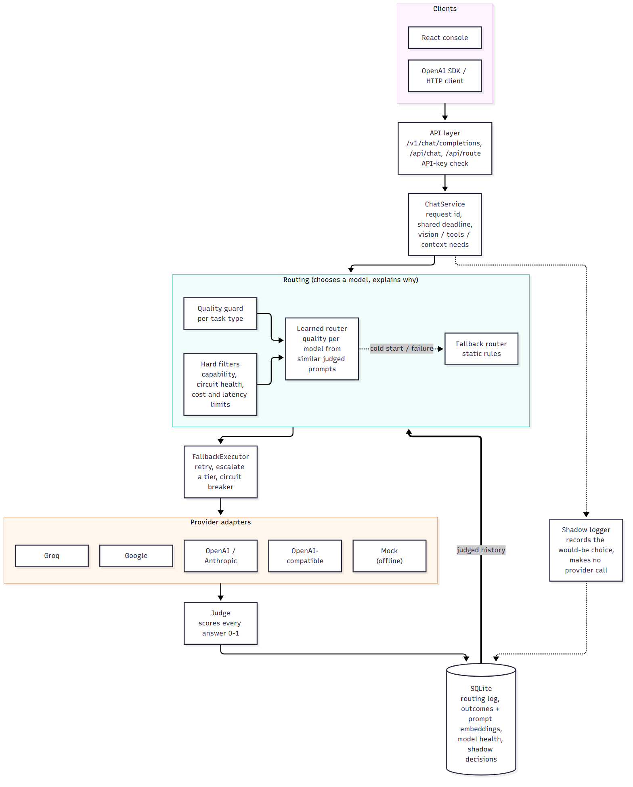
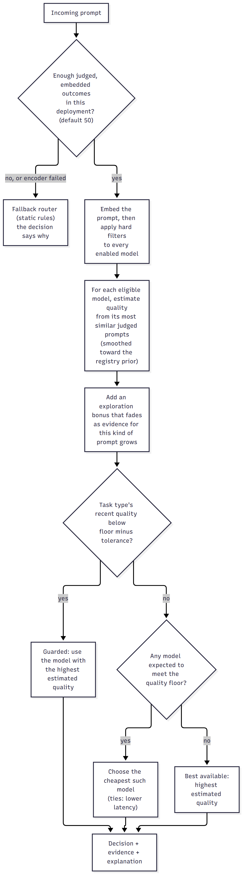
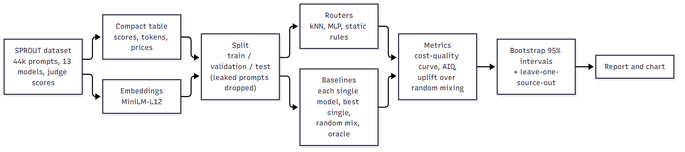
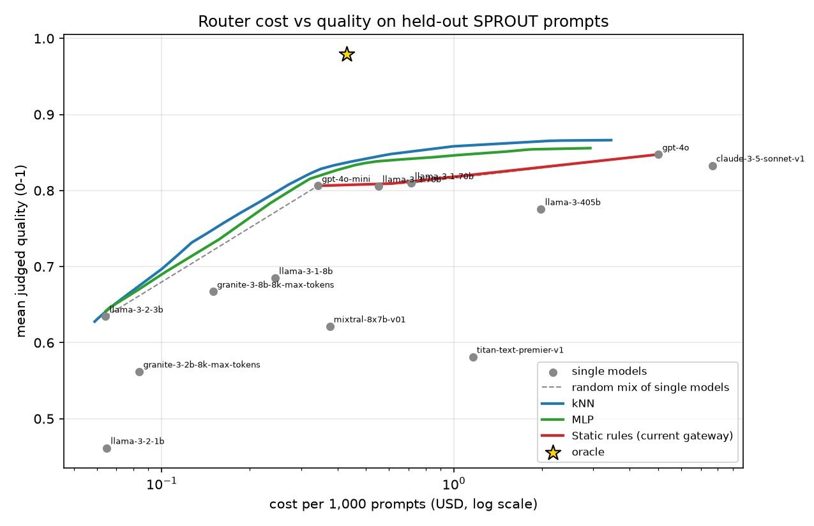

# Adaptive AI Gateway

Send every LLM request to the **cheapest model that is still good enough**, and be able to show why.

The gateway sits between your application and your model providers. It answers OpenAI-style requests, chooses a model for each one, calls it, scores the answer with a judge, and records what happened. Those records train a router that learns which models actually do well on *your* kind of prompts. Reliability features (circuit breakers, fallback, one shared deadline) keep a failing provider from taking your application down, and a shadow mode lets a new routing policy be observed before it is allowed to change anything.

> **Status:** the gateway, the learned router, shadow mode, the quality guard and the offline evaluation are built and tested (281 offline tests). The routing results are **offline, on a public benchmark**, and are modest; the learned router has not been run on live traffic. See [What has been measured](#what-has-been-measured) before drawing conclusions.

## Contents

[Why](#why) · [Architecture](#architecture) · [How a request is routed](#how-a-request-is-routed) · [How it compares](#how-it-compares-with-other-routers) · [What has been measured](#what-has-been-measured) · [Quick start](#quick-start) · [Using it](#using-it) · [Project structure](#project-structure) · [Documentation](#documentation) · [Limitations](#limitations) · [Roadmap](#roadmap)

## Why

Frontier models cost 20 to 60 times more per token than small ones, yet much real traffic does not need them. Sending everything to the strongest model is expensive; sending everything to the cheapest costs quality. The middle path is to predict, per request, whether a cheaper model will be good enough, and to stay useful when things go wrong: a provider outage, a slow model, a request that needs vision or tool calling, a caller with a hard cost ceiling.

Two things make that hard, and they shape this design:

- **Predicting quality is the hard part.** Hand-written rules ("long prompt, so use the big model") turned out to be no better than choosing at random when measured (see below). The router has to learn from outcomes.
- **A router that saves money by quietly hurting quality is worse than none.** So every answer is judged, every decision is explained, quality is watched per task type, and a new policy can be shadowed before it acts.

## Architecture



| Piece | Role |
|---|---|
| **API layer** | OpenAI-compatible (`/v1/chat/completions`) and native (`/api/*`) endpoints, protected by one bearer key when configured |
| **ChatService** | Runs one request: id, shared deadline, hard requirements (vision, tools, context), routing, execution, judging, logging |
| **Routing** | Hard filters (capability, circuit health, cost/latency limits), then the *learned router*, or the *static fallback router* while there is not enough data |
| **FallbackExecutor** | Calls the chosen model, retries on provider errors, escalates a tier on a low judge score, maintains circuit breakers |
| **Provider adapters** | Groq, Google, OpenAI, Anthropic, any OpenAI-compatible endpoint, plus an offline mock |
| **Judge** | Scores each answer 0 to 1; the scores are the training signal |
| **SQLite** | Routing log, per-attempt outcomes with prompt *embeddings* (never text by default), model health, shadow decisions |
| **Console** | React UI for chat, model health, analytics, benchmarks, datasets, training, experiments |

The full walk-through, including the request sequence diagram, is in [docs/ARCHITECTURE.md](docs/ARCHITECTURE.md).

## How a request is routed

1. **Hard filters.** A model that lacks a needed capability, has an open circuit, or would break the request's cost or latency limit is removed. It is never merely penalised, so a cheap model that cannot see images cannot win for being cheap.
2. **Learned router** (`ROUTER_TYPE=learned`). Embed the prompt. For each remaining model, find the most similar prompts it has already answered *in this deployment*, read the judge's scores, and estimate that model's quality for this kind of prompt, smoothed toward a prior so thin evidence cannot swing a decision. Add a small exploration bonus that fades as evidence grows. Choose the **cheapest model expected to meet the quality floor**. It considers every enabled model, not three fixed tiers.
3. **Fallback router** (`rule_based`). Keyword features, a difficulty guess and hand-set quality scores. Used automatically until the deployment has enough judged traffic (default 50 outcomes) and whenever the learned router fails; the decision says so.
4. **Quality guard.** If recent judged quality for a task type falls below the floor, that task type stops being cost-optimised until it recovers.
5. **Shadow mode.** Log what the learned router *would* have chosen for every request, without acting on it or calling any provider, so agreement and estimated cost change can be reviewed before any traffic moves.



The formulas, a worked example and the limits of each part are in [docs/HOW_ROUTING_WORKS.md](docs/HOW_ROUTING_WORKS.md).

**Rollout path this is built for:** shadow → small canary with the quality guard on → production, each step judged on measured quality.

## How it compares with other routers

Azure, AWS, Google, Databricks, OpenRouter and open-source projects such as RouteLLM and LiteLLM all route between models. Summary of their published designs (details, sources and dates in [docs/COMPARISON.md](docs/COMPARISON.md)):

| | Routes between | Decision | Adapts to your traffic? |
|---|---|---|---|
| Azure AI Foundry model router | Multi-vendor pool | Trained model; Balanced / Cost / Quality modes | Not described in docs |
| AWS Bedrock prompt routing | Two models of one family | Predicts per-prompt quality | No (docs say it cannot use application-specific data) |
| Databricks smart routing (beta) | Gateway catalog, for coding agents | Cheap model classifies the task once per session | Not described |
| OpenRouter Auto Router | Many providers | Task classifier plus recent community spend | No |
| LiteLLM | Any provider | Load balancing; heuristic/keyword auto router | Rules you write |
| RouteLLM (open source) | One strong, one weak model | Trained on public preference data | You can train your own |
| **This project** | Any registered model, mixed vendors | Learned from this deployment's judged outcomes; static fallback until enough data | Yes, by design |

What differs: the training data is your own and stays in your database, every decision is explained, hard constraints are separate from preference, and there is a way to observe before acting. What is weaker: a far smaller evaluation than the big platforms, no production track record, no managed service, no streaming yet. **No head-to-head benchmark against any of them has been run**, and the one large independent study found (LLMRouterBench) reports that many routers, including a commercial one, fail to reliably beat simply using the best single model.

## What has been measured

Offline evaluation on **SPROUT** (about 44,000 prompts from MATH, MMLU-Pro, GPQA, MuSR, RAGBench and OpenHermes, each answered and judge-scored by 13 models). Test set: 6,590 prompts the routers never saw. Intervals are 95% bootstrap over prompts. Full method, tables and caveats: [docs/EVALUATION.md](docs/EVALUATION.md); the code is in [`backend/routing_lab`](backend/routing_lab).



| Router | Quality gain over randomly mixing models (AIQ uplift) | 95% interval |
|---|---|---|
| Learned router (kNN) | **+0.030** | 0.025 to 0.035 |
| Learned router (small neural net) | +0.019 | 0.013 to 0.025 |
| Original static rules | +0.004 | 0.001 to 0.006 |



How to read it honestly:

- **The learned router adds a small but statistically clear amount; the original static rules add essentially nothing.** That is why learning from outcomes, not rules, is the core of the design.
- **A big "saving vs the best model" is mostly cheap models being nearly as good.** `gpt-4o` scored 0.848 at $5.01 per 1,000 prompts, but `gpt-4o-mini` alone scored 0.806 (95% of that) at $0.34. Against that fair baseline the router's extra saving is roughly 20% at the same quality bar (point estimates), not the 88% headline figure.
- **It does not transfer to data it has not seen.** With MMLU-Pro or OpenHermes held out of training, the saving at equal quality fell to 0%. The router must be trained on each deployment's own traffic, which is how it is built.
- **Average quality can hide losses.** At the matched operating point MMLU-Pro quality dropped from 0.796 to 0.685 while MATH improved. That is what the per-task quality guard is for.
- **Most of the headroom is untouched.** A perfect router would reach 0.98 quality at $0.43 per 1,000 prompts; the learned router gets about 0.83 at that cost.
- **Scope.** A benchmark mixture with 2024-era models and published list prices, not customer traffic and not this gateway's models. Online, the router only sees answers from models it chose, which is harder than this offline setting.

Treat this as evidence the approach works in principle, to be re-measured with replay, shadow mode and a live canary.

## Quick start

Requirements: Python 3.11+, Node.js 18+ (for the console), optionally Docker.

### No keys, no network (mock providers)

```bash
python scripts/dev.py --demo        # API on :8000, console on :5173
python scripts/e2e_demo.py          # scripted end-to-end check; prints what it verified
docker compose -f docker-compose.yml -f docker-compose.demo.yml up --build   # console on :8080
```

Demo mode answers with deterministic mock models and scores them with a heuristic judge. It proves the whole pipeline works (routing, fallback, judging, learning, shadow mode, auth) and says **nothing** about real model quality or real savings.

### With real providers

```bash
cd backend
python -m venv .venv && .venv\Scripts\activate       # macOS/Linux: source .venv/bin/activate
pip install -r requirements.txt
cp .env.example .env                                 # add GROQ_API_KEY, GOOGLE_API_KEY, ...
uvicorn app.main:app --reload --port 8000            # run from backend/: data paths are relative
```

```bash
cd frontend && npm install && npm run dev            # console on http://localhost:5173
```

Set `ROUTER_TYPE=learned` (optionally `SHADOW_ROUTER_ENABLED=true`) to use the learned router; it falls back to the static router until it has judged traffic. The embedding model needs `pip install -r requirements-ml.txt`, or set `EMBEDDING_MODEL=hashing` for a dependency-free, cruder encoder. Docker deployments: `docker compose up --build` (verified in demo mode only).

Free-tier providers throttle bursts, and the default registry uses small daily quotas for its secondary models; see [docs/REFERENCE.md](docs/REFERENCE.md#providers-and-models).

## Using it

Point any OpenAI SDK at the gateway and set `model` to `"auto"`:

```python
from openai import OpenAI

client = OpenAI(base_url="http://localhost:8000/v1", api_key="not-needed")   # your ROUTER_API_KEY if set
reply = client.chat.completions.create(
    model="auto",
    messages=[{"role": "user", "content": "Summarise merge sort."}],
)
print(reply.choices[0].message.content)
print(reply.model)      # the model the router actually chose
```

Ask for a routing decision without calling any model:

```bash
curl -X POST http://localhost:8000/api/route -H "Content-Type: application/json" \
  -d '{"prompt":"Write a Python function to detect a cycle in a linked list."}'
```

Useful reads once traffic flows: `GET /api/metrics`, `/api/usage`, `/api/health/models`, `/api/performance/models`, `/api/performance/segments` (quality guard), `/api/shadow/summary` (shadow mode). Per-request options (`max_cost`, `max_latency_ms`, `timeout_ms`, `preferred_model`, `user_id`, `tags`) and the full endpoint list are in [docs/REFERENCE.md](docs/REFERENCE.md).

## Project structure

```
backend/
  app/
    api/          route handlers (chat, OpenAI-compatible, models, metrics, shadow, ...)
    router/       features, task/difficulty, policy, hard filters, health, learned router, embedder
    services/     chat orchestration, fallback + deadline, outcome recording, shadow mode, jobs
    providers/    Groq, Google, OpenAI, Anthropic, OpenAI-compatible, mock
    evaluation/   judge, metrics, benchmarks
    db/           SQLite repositories
    ...           models (registry), schemas, datasets, training, utils, config
  routing_lab/    offline evaluation on SPROUT: download, embed, evaluate, report
  tests/          281 offline tests
frontend/         React console
scripts/          dev.py (one-command start), e2e_demo.py (end-to-end check)
docs/             architecture, routing logic, comparison, evaluation, reference, diagrams
docker-compose.yml, docker-compose.demo.yml
```

## Documentation

| Document | What it covers |
|---|---|
| [docs/ARCHITECTURE.md](docs/ARCHITECTURE.md) | Components, request lifecycle, reliability, data model, deployment |
| [docs/HOW_ROUTING_WORKS.md](docs/HOW_ROUTING_WORKS.md) | Static and learned routers, formulas, cold start, calibration, quality guard, shadow mode |
| [docs/COMPARISON.md](docs/COMPARISON.md) | Comparison with Azure, AWS, Google, Databricks, OpenRouter, LiteLLM, RouteLLM and others, with sources |
| [docs/EVALUATION.md](docs/EVALUATION.md) | Offline evaluation method, full results, weaknesses |
| [docs/REFERENCE.md](docs/REFERENCE.md) | Configuration, API, console, training the ML routers, development |
| [GATEWAY_AUDIT.md](GATEWAY_AUDIT.md) | Earlier technical audit of the gateway |
| [docs/diagrams/](docs/diagrams) | Mermaid sources of every diagram |

## Limitations

- **Offline evidence only.** The learned router has not been run on live traffic; only mock providers have been used end to end. The committed experiment report is a small smoke run, not evidence of savings.
- **Cold start.** Until a deployment has enough judged traffic the static rules route requests, and those were no better than random mixing offline.
- **Judge dependence.** Quality is whatever the judge says; a noisy or biased judge trains a biased router.
- **Bandit feedback.** Online, only answers from chosen models are observed; exploration and shadow mode widen the evidence but do not remove this.
- **No streaming.** `stream=true` is not supported.
- **Security model.** One shared API key; no per-customer keys, rate limits or tenant isolation. SQLite storage. Prompt embeddings are derived from prompt text, so treat the database as sensitive.
- **Docker** is verified in demo mode only.
- **The `tfidf`, `embedding` and `bert` routers** need training first and none ships trained.
- **Free-tier rate limits** affect batch jobs on the default registry.
- **Known circuit-breaker edge case:** a model whose single half-open trial fails with a non-retryable error can stay `HALF_OPEN` instead of reopening.

## Roadmap

| Status | Item |
|---|---|
| Done | Gateway, providers, fallback, circuit breakers, deadlines, capability-aware routing, OpenAI-compatible API, React console |
| Done | Learned router (all-model candidates, cold-start fallback), quality guard, shadow mode, per-deployment embedding collection |
| Done | Offline evaluation harness with baselines and confidence intervals |
| Next | Replay evaluation on a held-out real workload; live shadow run and canary on real providers |
| Next | Streaming responses |
| Later | Per-customer keys and rate limits, PostgreSQL, multi-tenant isolation |

## License

Academic project.
