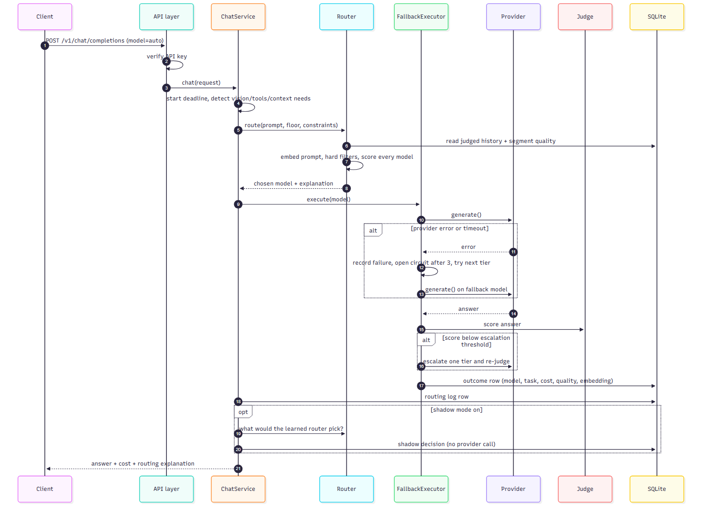

# Architecture

This document describes how the gateway is built and what happens to a request from the moment it arrives to the moment the answer goes back. For how the routing *decision* is made, see [HOW_ROUTING_WORKS.md](HOW_ROUTING_WORKS.md).

## The idea in one paragraph

Applications call one endpoint (an OpenAI-compatible API, or the native one). The gateway decides which underlying model should answer each request, calls that model, checks the answer with a judge, and records what happened. Those records are the raw material for better decisions later. Reliability features (circuit breakers, fallback, a shared deadline) keep a failing provider from taking the application down, and a *shadow mode* lets a new routing policy be observed before it is allowed to change anything.

## System overview

Diagram source (Mermaid)

The same diagram lives as text in [diagrams/01-architecture.mmd](diagrams/01-architecture.mmd) and renders directly on GitHub.

| Layer | What it does | Where |
|---|---|---|
| API layer | Two front doors: OpenAI-compatible (`/v1/chat/completions`, `/v1/models`) and native (`/api/*`). One shared bearer-key dependency protects both when `ROUTER_API_KEY` is set. `/health` stays open. | `backend/app/api/`, `backend/app/main.py` |
| ChatService | Orchestrates one request: assigns a request id, starts the shared deadline, derives hard requirements (vision, tools, context length) from the request, routes, executes, judges, logs. | `backend/app/services/chat.py` |
| Routing | Chooses a model and explains why. Hard filters first, then either the learned router or the static fallback router. | `backend/app/router/` |
| FallbackExecutor | Calls the chosen model; on a retryable provider error tries the next model, on a low judge score escalates one tier; enforces the circuit breaker and the deadline. | `backend/app/services/fallback.py`, `deadline.py`, `router/health.py` |
| Provider adapters | One small adapter per vendor behind a common interface: Groq, Google, OpenAI, Anthropic, any OpenAI-compatible endpoint, and an offline mock. | `backend/app/providers/` |
| Judge | Scores each answer from 0 to 1 (correctness, relevance, completeness, reasoning, instruction following). Can be a heuristic mock, an OpenAI model, or any model in the registry. | `backend/app/evaluation/judge.py` |
| Storage | SQLite: routing log, per-attempt model outcomes (with the prompt *embedding*, never the text unless `STORE_PROMPTS` is on), model health, shadow decisions, background jobs. | `backend/app/db/` |
| Console | React app: overview, chat with routing explanation, model registry and health, analytics, benchmarks, datasets, training, experiments, settings. | `frontend/` |
| Offline lab | Separate from the gateway: trains and evaluates routers on a public dataset with baselines and confidence intervals. | `backend/routing_lab/` |

## Request lifecycle

Step by step (numbers refer to code, not the diagram):

1. **Authenticate.** `verify_router_api_key` compares the bearer token in constant time when a key is configured.
2. **Start the clock.** If the caller sent `timeout_ms`, one `RequestDeadline` covers *everything* that follows (generation, fallback, judging, escalation). It is a single budget, not a per-attempt one.
3. **Derive requirements.** Images in the messages mean vision is required; a `tools` list means tool calling; estimated input tokens plus `max_tokens` set a minimum context window.
4. **Route** (only for `model: "auto"`). A pinned model skips routing but is still checked against the request's cost and latency limits.
   - **Hard filters** remove any model that lacks a needed capability, whose circuit is open, or that would break `max_cost` / `max_latency_ms`. A filtered model is never merely penalised; it cannot be chosen.
   - The **learned router** or the **fallback router** then picks among what is left (see [HOW_ROUTING_WORKS.md](HOW_ROUTING_WORKS.md)).
5. **Collect** the prompt embedding (a vector, not text) when learning or shadow mode is enabled.
6. **Generate.** The executor claims a slot on the model's circuit breaker, calls the provider inside the deadline, and records the attempt.
7. **Recover.** A timeout, rate limit, network or provider error is retried on the next model up (`tier_up`) or on the strongest model (`strong_only`), up to `MAX_FALLBACK_ATTEMPTS`. Only genuine provider failures count against a model's health; running out of *request* time never does.
8. **Judge.** The answer is scored. A score below `FALLBACK_ON_QUALITY_BELOW` escalates one tier and is re-scored. If the judge itself fails, the answer is returned unscored rather than failing the request.
9. **Record.** One outcome row per provider attempt (model, task type, difficulty, latency, cost, quality, embedding) and one routing-log row per request.
10. **Shadow** (optional). The learned router is asked what it *would* have chosen for the same prompt; the comparison is logged. No provider is called and any error here is swallowed.
11. **Respond** with the answer, token usage, cost, and the routing explanation (task type, difficulty, per-model estimates, what was excluded and why, whether the fallback was used).

## Reliability

- **Circuit breaker per model** (`router/health.py`). After `HEALTH_FAILURE_THRESHOLD` (default 3) consecutive retryable failures a model's circuit opens and routing skips it. After `HEALTH_COOLDOWN_SECONDS` (default 30) one half-open trial request is allowed; success closes the circuit. State is persisted, so a restart does not forget an outage.
- **Fallback chain** (`services/fallback.py`). Routed model first, then the next tiers up, skipping open circuits. If everything looks unhealthy it fails open rather than refusing to try.
- **Shared deadline** (`services/deadline.py`). `timeout_ms` bounds the whole request. It is deliberately separate from `max_latency_ms`, which is a *routing constraint* on a model's average latency.
- **Errors are typed.** Missing keys, bad requests and unsupported capabilities are non-retryable client errors and are never blamed on the model.

## Data model

| Table | One row per | Used for |
|---|---|---|
| `routing_logs` | completed request | metrics, cost and usage reports, scoped by user / session / tags |
| `model_outcomes` | provider attempt (initial, fallback, escalation) | historical performance, calibration, learned-router training (holds the prompt embedding) |
| `model_health` | model | circuit-breaker state |
| `shadow_decisions` | shadowed request | comparing would-be choices with what was served |
| `jobs`, `benchmark_reports` | background job / report | restart-safe dataset, training, benchmark and experiment runs |

Privacy note: prompt text is stored only when `STORE_PROMPTS=true`. With learning on, the *embedding* of each prompt is stored with its judged outcome. Embeddings are not text but are derived from it, so treat the database as sensitive.

## Deployment

- **Local**: `python scripts/dev.py --demo` (no keys, mock providers) or `python scripts/dev.py` (real providers, keys in `backend/.env`).
- **Docker**: `docker-compose.yml` runs the API (port 8000) and an nginx-served console (port 8080, proxying `/api`, `/v1` and `/health` to the API). State lives on named volumes. `docker-compose.demo.yml` adds the keyless demo settings. This has been verified in demo mode only.
- **State and paths** resolve relative to the working directory, so run the backend from `backend/`.

## Extending it

- **New provider**: implement the adapter interface in `backend/app/providers/`, register it in `providers/factory.py`, add models to the registry.
- **New router**: implement `Router.route()` in `backend/app/router/`, register it in `router/base.py::create_router`, add the value to `ROUTER_TYPE`.
- Both seams are covered by offline tests that need no keys: `cd backend && python -m pytest -q`.
