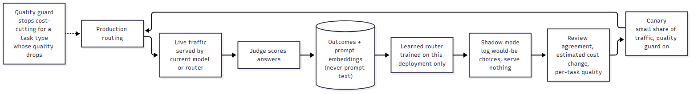

# How routing works

The gateway's job is to answer each request with the cheapest model that is still good enough. This document explains exactly how "cheapest" and "good enough" are decided, in the order a request meets them. For the surrounding system see [ARCHITECTURE.md](ARCHITECTURE.md); for how well it works, see [EVALUATION.md](EVALUATION.md).

## 1. Hard filters come first

Before any scoring, every candidate model is tested against rules that are pass/fail, not preferences:

| Filter | A model is removed if... |
|---|---|
| Capability | the request needs vision or tool calling and the model lacks it, or the request would not fit its context window |
| Health | its circuit breaker is open (recent repeated provider failures) |
| Constraints | its estimated cost or average latency exceeds the request's `max_cost` / `max_latency_ms` |

If the caller named a `preferred_model`, it is honoured only if it passes all three; otherwise routing continues among the others and the explanation says why the preference was not used. If *nothing* passes, the request fails with a clear per-model reason instead of quietly picking something unsuitable.

This ordering matters: a cheap model that cannot see images must never win because it is cheap.

## 2. Two routers, one interface

`ROUTER_TYPE` selects the policy. Both return the same decision object (chosen model, tier, estimated cost and quality, a list of human-readable reasons, per-model estimates).

### Fallback router (`rule_based`) — the safe default

No data needed. It works in four steps:

1. **Features** from the prompt: length, question and instruction counts, whether it contains code or maths, reasoning words (`why`, `explain`, `compare`, ...), requested output format.
2. **Task type** (one of 13, such as coding, debugging, mathematics, summarisation, translation) by whole-word keyword matching.
3. **Difficulty** from 0 to 1: a base value per task type plus small bumps for length, instructions, reasoning language, code and maths.
4. **Expected quality per tier** = the model's registry `quality_score` + a small task-fit boost − `difficulty × penalty`, where the penalty is 0.18 for the small tier, 0.10 for medium and 0.05 for strong. Among tiers that meet the quality floor it takes the best weighted cost/latency score (70% cost, 30% latency); if none meets the floor it takes the highest expected quality.

Its strength is that it is fully explainable and works from the first request. Its weakness is that the numbers are hand-set. On the offline evaluation it added essentially nothing over randomly mixing models (uplift +0.004, interval 0.001 to 0.006), so it is a safety net, not the product. Measured quality is blended into its prior once a model has 10 or more judged answers for a task type (`router/feedback.py`).

### Learned router (`learned`) — trained on your own traffic

It answers a different question. Instead of "how hard does this prompt look?", it asks: **"how well has each model actually done on prompts like this one, in this deployment?"**

For the incoming prompt:

1. **Embed** it into a 384-number vector (default encoder `all-MiniLM-L12-v2`; `hashing` is a crude dependency-free fallback).
2. For each eligible model, look at that model's *past judged answers* and find the ones whose prompts are most similar (cosine similarity, top `k=40`).
3. **Weight** each neighbour by similarity: `w = clip((cosine − 0.5) / 0.5, 0, 1)`. Prompts below 0.5 similarity count for nothing.
4. **Estimate quality**, smoothed toward the registry prior so thin evidence cannot swing a decision:

   ```
   q_hat = (prior × 3 + Σ w·quality) / (3 + Σ w)
   ```

   With no similar history the sums vanish and `q_hat` is just the prior.
5. **Add an exploration bonus** that shrinks as evidence grows:

   ```
   optimistic = q_hat + 0.10 / sqrt(1 + Σ w)
   ```

   This is how a cheap model that has not been tried on this kind of prompt still gets a chance, and produces the evidence that settles the question.
6. **Choose** the cheapest eligible model whose `optimistic` value meets the quality floor (ties go to lower latency). If none does, take the highest `q_hat`.


Source: [diagrams/03-learned-decision.mmd](diagrams/03-learned-decision.mmd).

**Worked example** (illustrative arithmetic, not measured data). Quality floor 0.80. A cheap model has a prior of 0.88. For a "hash table collisions" prompt it has 12 similar judged answers with an average judged quality of 0.55 and an average similarity weight of 0.8:

```
Σ w = 9.6        Σ w·quality = 5.28
q_hat      = (0.88 × 3 + 5.28) / (3 + 9.6) = 0.63
optimistic = 0.63 + 0.10 / sqrt(10.6)      = 0.66   → below the 0.80 floor, excluded
```

A mid-priced model with no history for this kind of prompt keeps `q_hat = 0.90` and `optimistic = 1.00`, so it is chosen. For a *different* prompt type where the cheap model has been judged well, the same cheap model is chosen. The router is local to the kind of prompt, which a single average quality score per model cannot be.

### Every candidate, not one per tier

The fallback router picks among three tiers and resolves each tier to its cheapest model. The learned router scores **every enabled model** that survives the hard filters, so a strong model that is cheap, or a small model that is unusually good at one task, can be found.

## 3. Cold start and failure: never a cliff

The learned router refuses to pretend it knows a deployment it has not seen:

- With fewer than `LEARNED_MIN_SAMPLES` (default 50) judged, embedded outcomes in this deployment's database, requests go to the fallback router.
- If the encoder cannot load or embedding fails, requests go to the fallback router.
- In both cases the decision says so ("Fallback routing (static rules): only N judged outcomes ... it has not learned your traffic yet") and `features.router_type` is `learned:fallback`.

## 4. Customer calibration

The learned router reads only the database it lives in. Each deployment (or customer, if you run one per customer) therefore calibrates to its own workload with no shared model to leak or drift. This is a requirement, not a convenience: in the offline evaluation a router trained without a given data source saved *nothing* on that source. A router trained on someone else's traffic should not be assumed to fit yours.

A second, coarser tool recalibrates the registry's hand-set quality scores from judged outcomes: `GET /api/performance/calibration` previews and `POST /api/performance/calibration/apply` applies (Bayesian shrinkage toward the old value, adjusted for prompt difficulty). Re-applying over the same window double-counts it; pass `since` on repeat runs.

## 5. Quality guard

Average quality can hide damage. If cost-cutting quietly degrades one kind of task, the average may barely move. The guard watches each task type separately:

- It looks at the last `GUARD_WINDOW` (50) judged answers for that task type, whichever model wrote them.
- If there are at least `GUARD_MIN_SAMPLES` (20) and their mean is below `quality floor − GUARD_TOLERANCE` (0.05), that segment is **guarded**: the router stops cost-optimising it and uses the model with the highest estimated quality until the recent average recovers.
- `GET /api/performance/segments` shows every task type, its recent quality and whether it is degraded.

The guard is deliberately simple so it can be explained in one sentence to whoever is paying the bill.

## 6. Shadow mode: observe before you act

With `SHADOW_ROUTER_ENABLED=true` every request is served exactly as before (a pinned model or the configured router). Afterwards the learned router is asked what it would have chosen for the same prompt, and the comparison is stored:

- No extra provider call is made and any failure is swallowed, so shadow mode cannot affect a request.
- `GET /api/shadow/summary` reports the **agreement rate**, the **estimated cost change** (the shadow model's cost for the same amount of output), the mix of decision modes, and a per-task breakdown.
- The shadow model's quality is a *prediction*; it was never run. Shadow mode is a screening step that tells you whether a live canary is worth running, not a measurement of savings.

The intended path is: **shadow → small canary with the quality guard on → production**, with each step judged on measured quality.



Source: [diagrams/04-rollout-flywheel.mmd](diagrams/04-rollout-flywheel.mmd).

## 7. What the decision tells you

Every routing response carries:

- the chosen model and tier, the task type and difficulty;
- the estimated cost and quality, and the cost against always using the strongest model;
- per-model estimates, each marked *measured, n=…* (backed by judged answers) or *assumed*;
- the reasons: what was excluded and why, whether the choice was on optimism, guarded, or from the fallback router.

That transparency is a design goal, not a by-product: a routing decision that cannot be explained cannot be trusted with production traffic.

## Known limits of the learned router

- **Bandit feedback.** History only contains answers from models that were chosen. The exploration bonus and shadow evaluation widen the evidence, but the router never sees what an unchosen model would have said. The offline evaluation used full-information data, so its numbers are not a forecast for this online setting.
- **Judge dependence.** "Quality" is whatever the judge says. A biased or noisy judge trains a biased router. Using the same model as both judge and a routed model lets it grade itself.
- **Small samples.** Below a few dozen judged answers per kind of prompt the estimate is mostly the prior.
- **Cost model.** Cost estimates use registry prices and an assumed output length; real cost depends on what the model writes.
